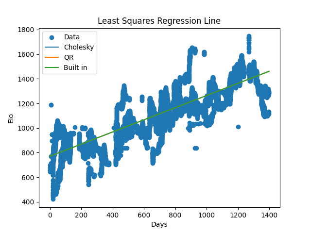
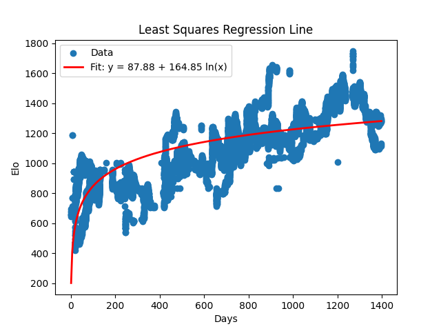

# Chess Rating Curve Fitting

A numerical linear algebra project analyzing several years of my Chess.com blitz history to answer a simple question:

**Has my chess rating improved consistently over time?**

Using roughly **14,000 games**, I fit rating as a function of time and compared multiple least-squares solution methods, including **QR decomposition**, **Cholesky factorization**, and NumPy's built-in solver.

The project also includes the supporting chess-data pipeline used to turn raw PGN games into a structured SQLite dataset and optionally analyze games with Stockfish.

## Results

The data shows a strong linear trend in rating over time.

| Metric                       |        Result |
| ---------------------------- | ------------: |
| Games                        |       ~14,000 |
| Time span                    |     2022–2025 |
| Linear (R^2)                 |        ~0.757 |
| Slope                        | ~0.47 Elo/day |
| Intercept                    |      ~800 Elo |
| Condition number (\kappa(X)) |         ~1462 |

The fitted model is approximately

[
\text{Elo} = 800 + 0.47(\text{days})
]

or roughly **170 Elo of improvement per year** over the period studied.

Despite the relatively large condition number, the different least-squares methods produced effectively identical fits for this dataset. The numerical differences between the most and least stable approaches were on the order of (10^{-8}).



## Numerical Methods

The main purpose of the project was not simply to call a regression library, but to compare the numerical methods used to solve the least-squares problem

[
\min_{\beta}|X\beta-y|_2^2.
]

### Cholesky Factorization

The Cholesky implementation forms the normal equations

[
X^TX\beta=X^Ty
]

and factors

[
X^TX=LL^T.
]

The two resulting triangular systems are solved using explicit forward and backward substitution.

This approach is computationally inexpensive, but forming (X^TX) squares the condition number:

[
\kappa(X^TX)=\kappa(X)^2.
]

That makes it increasingly sensitive to floating-point error as the original problem becomes ill-conditioned.

### QR Decomposition

QR instead factors the design matrix directly:

[
X=QR
]

and solves

[
R\beta=Q^Ty.
]

It avoids explicitly forming (X^TX), making it substantially more numerically stable for ill-conditioned least-squares problems.

### NumPy Solver

NumPy provides a highly optimized reference implementation. Comparing the custom methods against NumPy makes it possible to verify that they converge to essentially the same regression coefficients.

For this relatively small problem, the performance differences are minor enough that numerical stability is generally more important than saving a few hundred microseconds.

## Alternative Models

I also tested nonlinear models to see whether the apparent improvement was better described by something other than a straight line.

### Logarithmic



The logarithmic fit performed worse than the linear model.

### Quadratic

A quadratic model produced only a very small improvement in (R^2), not enough to justify the additional complexity.

The simple linear model therefore provides the most useful description of the data: improvement was approximately steady rather than showing a strong plateau or acceleration.

## Data Pipeline

The repository contains more than the regression itself. Raw chess games can be converted into a relational SQLite representation for further analysis.

The database stores information including:

* players
* events
* games and results
* player Elo
* dates and time controls
* ECO/opening information
* individual moves
* SAN and UCI notation
* captures, checks, mates, and promotions
* FEN positions before moves

This makes the dataset usable for analyses beyond rating progression.

## Stockfish Analysis

`analysis.py` can run Stockfish over the stored games and attach engine-derived statistics to each game.

It computes values including:

* average centipawn loss (ACPL)
* per-player accuracy estimates
* number of analyzed plies
* engine analysis time

Analysis is parallelized across multiple worker processes, with each worker running its own single-threaded Stockfish instance.

The resulting values are written back into the SQLite database in an `analysis` table.

## Repository Structure

```text
data_project/
├── all_games.pgn        # Raw chess games
├── chess.db             # SQLite chess database
├── matrix.py            # PGN -> SQLite import pipeline
├── analysis.py          # Parallel Stockfish analysis
├── math.py              # Regression and numerical-method comparison
├── generate_hashes.py   # Row hashing / duplicate detection
├── linear.png           # Linear regression visualization
└── log.png              # Logarithmic model visualization
```

## Running the Regression

Clone the repository:

```bash
git clone https://github.com/bsig1/data_project.git
cd data_project
```

Install the Python dependencies:

```bash
pip install numpy matplotlib python-chess tqdm
```

Then run:

```bash
python math.py
```

The script loads rating history from `chess.db`, calculates the condition number, fits the data using the implemented solvers, prints their coefficients and (R^2) values, and displays the resulting regression plot.

## Running the Full Pipeline

The supporting scripts contain configuration constants for database, PGN, and Stockfish paths. Update those for your system before rebuilding or reanalyzing the dataset.

A typical workflow is:

```text
PGN games
   │
   ▼
matrix.py
   │
   ▼
SQLite database
   │
   ├──► analysis.py ──► Stockfish statistics
   │
   └──► math.py ──────► regression + numerical comparison
```

Stockfish must be installed separately if engine analysis is desired.

## Takeaways

This project ended up demonstrating two things at once.

From the chess side, the data provides strong evidence of consistent rating improvement across the period studied.

From the numerical-computing side, it illustrates why two algorithms that theoretically solve the same least-squares problem are not necessarily interchangeable. Cholesky and normal-equation-based approaches can be attractive for their speed, while QR and SVD-based approaches become increasingly valuable as conditioning worsens.

On this dataset, all of them agree almost perfectly. On a more difficult numerical problem, that may not be the case.

## Tech

**Python · NumPy · Matplotlib · SQLite · python-chess · Stockfish**
